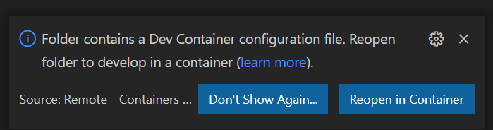
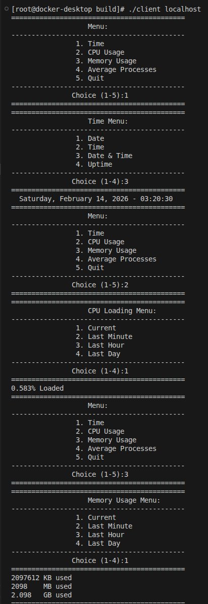

# CPRE 5500 Project 1 RPC
[Github Repository](https://github.com/waterboy741/CPRE_550_Proj_1)  
[Docker Image](https://hub.docker.com/repository/docker/willgalles/rpc_container/general)  

This project set out to learn RPC using SunRPC. This project consists of a client program and a server program that communicate via multiple RPC calls that allow the user to access remote information.
## Four Methods for running code
### Docker Container
The latest build of the code has been compiled into a minimal docker image that contains all of the needed dependencies to run the two programs
```
ensure you have docker installed
docker pull willgalles/rpc_container:Init
docker run -it --network=host willgalles/rpc_container:Init /bin/bash
cd /home
./server &
./client localhost 
```

### Build and run using the included vscode dev container
```
git clone https://github.com/waterboy741/CPRE_550_Proj_1.git
ensure you have docker installed
ensure you have the devcontainers extension installed for vscode
open folder up in vscode
click on prompt that asks to open up folder in container
open a terminal in vscode and navigate to the build folder
run cmake ..
run make
./server &
./client localhost 
```


### Build and Run locally
```
git clone https://github.com/waterboy741/CPRE_550_Proj_1.git
In CMakeLists.txt set RPC_LIBRARY PATHS to your RPC library path
In CMakeLists.txt set RPC_INCLUDE_DIR PATHS to your RPC include directory
navigate to the build folder
run cmake ..
run make
./server &
./client localhost 
```
### Run the prebuilt versions locally
These will only work on x86 machines!
```
git clone https://github.com/waterboy741/CPRE_550_Proj_1.git
navigate to the PreBuilt_Services folder
./server &
./client localhost 
```


